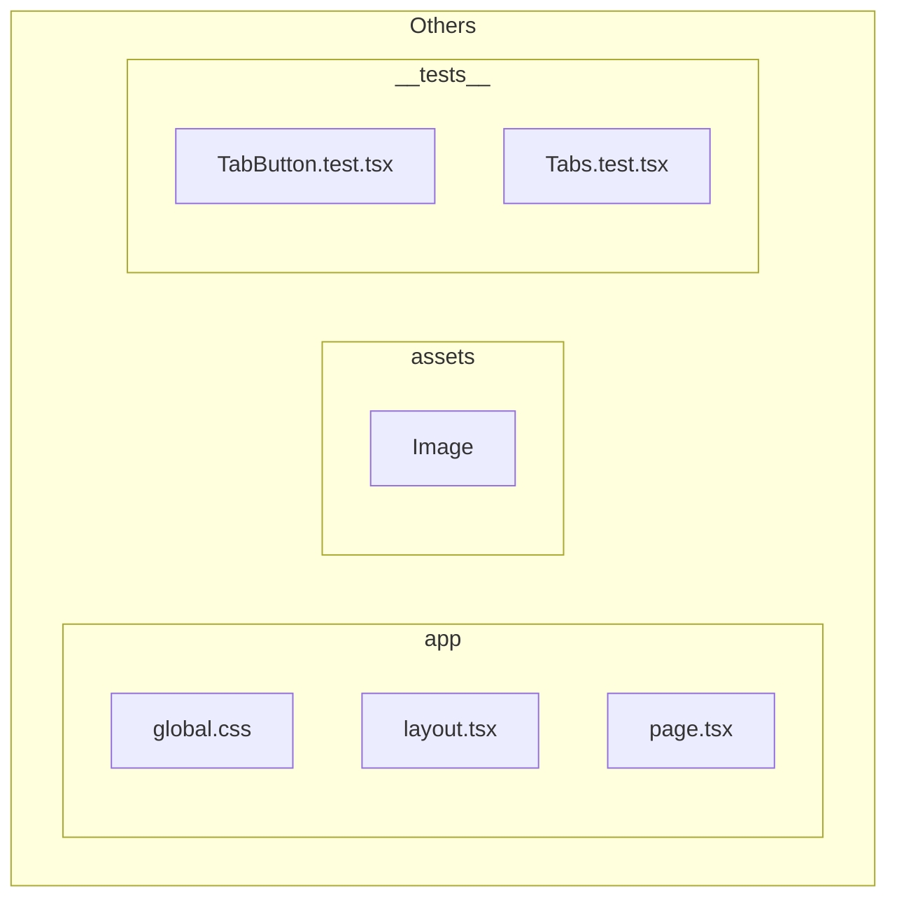

# My Profile Card

**Developed by** **`Grace Chen Abudi`** 👩🏽‍💻

## 📣 Overview:

- [My Profile Card](#my-profile-card)
  - [📣 Overview:](#-overview)
  - [🔎 Intro:](#-intro)
  - [🧰 Tech Stack:](#-tech-stack)
  - [🏗️ Architecture Overview:](#️-architecture-overview)

---

## 🔎 Intro:

Welcome to my project showcasing a modern and organized approach to building a profile card with dynamic tabs using **Next.js**, **TypeScript**, and **Tailwind CSS**. This project aims to provide a streamlined and modular structure for displaying profile information through a responsive and visually appealing UI.

**`Key features include`**:

- **Profile Card**: A visually appealing card displaying user information and a profile picture.
- **Dynamic Tabs**: Tabs for displaying different sections such as About Me, Experience, Tech Stack, and Contact information.
- **Reusable Components**: Utilizes reusable components like TabButtons for seamless navigation between tabs.
- **Organized Structure**: Follows a structured approach with components organized into **components**, **common**, and **styles** directories for clarity and maintainability.
- **Comprehensive Testing**: Ensures reliability and correctness with **_unit tests_** using **Jest** and **React Testing Library**. Test cover rendering and interaction for all major components, including dynamic tab navigation and individual tab content.

This project not only demonstrates proficiency in modern web development technologies but also emphasizes best practices in component-based architecture, user interface design, and comprehensive testing. Whether you're exploring frontend development or looking for inspiration in organizing complex UI components, this project serves as a practical example of effective implementation.

---

## 🧰 Tech Stack:

- NextJS
- TypeScript
- TailwindCSS
- Responsive Layout
- Jest
- Unit Tests

---

## 🏗️ Architecture Overview:

